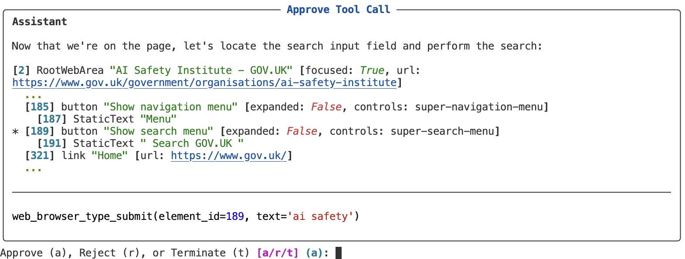
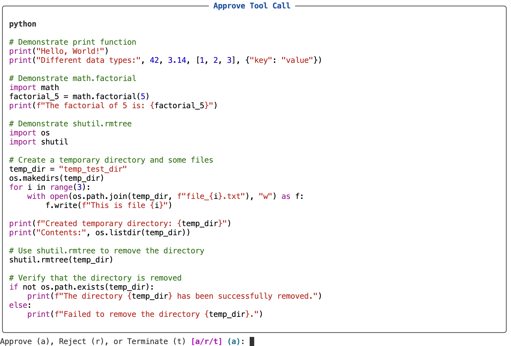

# Approval


## Overview

Inspect’s approval mode enables you to create fine-grained policies for
approving tool calls made by models. For example, the following are all
supported:

1.  All tool calls are approved by a human operator.
2.  Select tool calls are approved by a human operator (the rest being
    executed without approval).
3.  Custom approvers that decide to either approve, reject, or escalate
    to another approver.

Custom approvers are very flexible, and can implement a wide variety of
decision schemes including informal heuristics and assessments by
models. They could also support human approval with a custom user
interface on a remote system (whereby approvals are sent and received
via message queues).

Approvers can be specified at either the eval level or at the task
level. The examples below will demonstrate eval-level approvers, see the
[Task Approvers](#task-approvers) section for details on task-level
approvers.

## Human Approver

The simplest approval policy is interactive human approval of all tool
calls. You can enable this policy by using the `--approval human` CLI
option (or the `approval = "human"`) argument to `eval()`:

``` bash
inspect eval browser.py --approval human
```

This example provides the model with the built-in [web
browser](tools.qmd#sec-web-browser) tool and asks it to navigate to a
web and perform a search.

## Auto Approver

Whenever you enable approval mode, all tool calls must be handled in
some fashion (otherwise they are rejected). However, approving every
tool call can be quite tedious, and not all tool calls are necessarily
worthy of human oversight.

You can chain to together the `human` and `auto` approvers in an
*approval policy* to only approve selected tool calls. For example, here
we create a policy that asks for human approval of only interactive web
browser tool calls:

``` yaml
approvers:
  - name: human
    tools: ["web_browser_click", "web_browser_type"]

  - name: auto
    tools: "*"
```

Navigational web browser tool calls (e.g. `web_browser_go`) are approved
automatically via the catch-all `auto` approver at the end of the chain.
Note that when listing an approver in a policy you indicate which tools
it should handle using a glob or list of globs. These globs are prefix
matched so the `web_browser_type` glob matches both `web_browser_type`
and `web_browser_type_submit`.

To use this policy, pass the path to the policy YAML file as the
approver. For example:

``` bash
inspect eval browser.py --approval approval.yaml
```

You can also match on tool arguments (for tools that dispatch many
action types). For example, here is an approval policy for the [Computer
Tool](tools.qmd#sec-computer) which allows typing and mouse movement but
requires approval for key combos (e.g. Enter or a shortcut) and typing:

**approval.yaml**

``` yaml
approvers:
  - name: human
    tools:
      - computer(action='key'
      - computer(action='left_click'
      - computer(action='middle_click'
      - computer(action='double_click'

  - name: auto
    tools: "*"
```

Note that since this is a prefix match and there could be other
arguments, we don’t end the tool match pattern with a parentheses.

## Approvers in Code

We’ve demonstrated configuring approvers via a YAML approval policy
file—you can also provide a policy directly in code (useful if it needs
to be more dynamic). Here’s a pure Python version of the example from
the previous section:

``` python
from inspect_ai import eval
from inspect_ai.approval import ApprovalPolicy, human_approver, auto_approver

approval = [
    ApprovalPolicy(human_approver(), ["web_browser_click", "web_browser_type*"]),
    ApprovalPolicy(auto_approver(), "*")
]

eval("browser.py", approval=approval, trace=True)
```

## Task Approvers

You can specify approval policies at the task level using the `approval`
parameter when creating a `Task`. For example:

``` python
from inspect_ai import Task, task
from inspect_ai.scorer import match
from inspect_ai.solver import generate, use_tools
from inspect_ai.tool import bash, python
from inspect_ai.approval import human_approver

@task
def linux_task():
    return Task(
        dataset=read_dataset(),
        solver=[
            use_tools([bash(), python()]),
            generate(),
        ],
        scorer=match(),
        sandbox=("docker", "compose.yaml"),
        approval=human_approver()
    )
```

Note that as with all of the other `Task` options, an `approval` policy
defined at the eval-level will override a task-level approval policy.

## Custom Approvers

Inspect includes two built-an approvers: `human` for interactive
approval at the terminal and `auto` for automatically approving or
rejecting specific tools. You can also create your own approvers that
implement just about any scheme you can imagine.

Custom approvers are functions that return an `Approval`, which consists
of a decision and an explanation. Here is the source code for the `auto`
approver, which just reflects back the decision that it is initialised
with:

``` python
@approver(name="auto")
def auto_approver(decision: ApprovalDecision = "approve") -> Approver:
    
    async def approve(
        message: str,
        call: ToolCall,
        view: ToolCallView,
        state: TaskState | None = None,
    ) -> Approval:
        return Approval(decision=decision, explanation="Automatic decision.")

    return approve
```

There are five possible approval decisions:

| Decision  | Description                                                                                          |
|-----------|------------------------------------------------------------------------------------------------------|
| approve   | The tool call is approved                                                                            |
| modify    | The tool call is approved with modification (included in `modified` field of `Approver`)             |
| reject    | The tool call is rejected (report to the model that the call was rejected along with an explanation) |
| escalate  | The tool call should be escalated to the next approver in the chain.                                 |
| terminate | The current sample should be terminated as a result of the tool call.                                |

Here’s a more complicated custom approver that implements an allow list
for bash commands. Imagine that we’ve implemented this approver within a
Python package named `evaltools`:

``` python
@approver
def bash_allowlist(
    allowed_commands: list[str],
    allow_sudo: bool = False,
    command_specific_rules: dict[str, list[str]] | None = None,
) -> Approver:
    """Create an approver that checks if a bash command is in an allowed list."""

    async def approve(
        message: str,
        call: ToolCall,
        view: ToolCallView,
        state: TaskState | None = None,
    ) -> Approval:

        # Make approval decision
        
        ...

    return approve
```

Assuming we have properly [registered our
approver](extensions.qmd#sec-extensions-approvers) as an Inspect
extension, we can then use this it in an approval policy:

``` yaml
approvers:
  - name: evaltools/bash_allowlist
    tools: "bash"
    allowed_commands: ["ls", "echo", "cat"]

  - name: human
    tools: "*"
```

These approvers will make one of the following approval decisions for
each tool call they are configured to handle:

1)  Allow the tool call (based on the various configured options)
2)  Disallow the tool call (because it is considered dangerous under all
    conditions)
3)  Escalate the tool call to the human approver.

Note that the human approver is last and is bound to all tools, so
escalations from the bash and python allow list approvers will end up
prompting the human approver.

See the documentation on [Approver
Extensions](extensions.qmd#sec-extensions-approvers) for additional
details on publishing approvers within Python packages.

## Tool Views

By default, when a tool call is presented for human approval the tool
function and its arguments are printed. For some tool calls this is
adequate, but some tools can benefit from enhanced presentation. For
example:

1)  The interactive features of the web browser tool (clicking, typing,
    submitting forms, etc.) reference an `element_id`, however this ID
    isn’t enough context to approve or reject the call. To compensate,
    the web browser tool provides some additional context (a snippet of
    the page around the `element_id` being interacted with).

    

2)  The `bash()` and `python()` tools take their input as a string,
    which especially for multi-line commands can be difficult to read
    and understand. To compensate, these tools provide an alternative
    view of the call that formats the code and as multi-line syntax
    highlighted code block.

    

### Example

Here’s how you might implement a custom code block viewer for a bash
tool:

``` python
from inspect_ai.tool import (
    Tool, ToolCall, ToolCallContent, ToolCallView, ToolCallViewer, tool
)

# custom viewer for bash code blocks
def bash_viewer() -> ToolCallViewer:
    def viewer(tool_call: ToolCall) -> ToolCallView:
        code = tool_call.arguments.get("cmd", tool_call.function).strip()
        call = ToolCallContent(
            format="markdown",
            content="**bash**\n\n```bash\n" + code + "\n```\n",
        )
        return ToolCallView(call=call)

    return viewer


@tool(viewer=bash_viewer())
def bash(timeout: int | None = None) -> Tool:
    """Bash shell command execution tool.
    ...
```

The `ToolCallViewer` gets passed the `ToolCall` and returns a
`ToolCallView` that provides one or both of `context` (additional
information for understand the call) and `call` (alternate rendering of
the call). In the case of the bash tool we provide a markdown code block
rendering of the bash code to be executed.

The `context` is typically used for stateful tools that need to present
some context from the current state. For example, the web browsing tool
provides a snippet from the currently loaded page.
